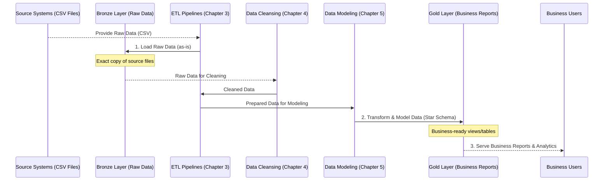
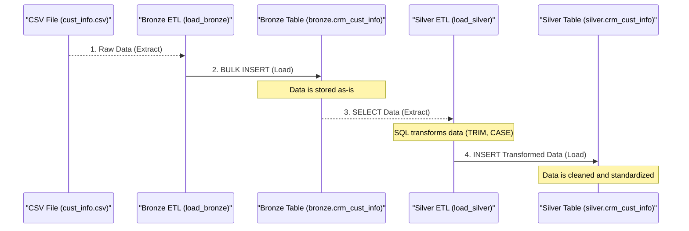
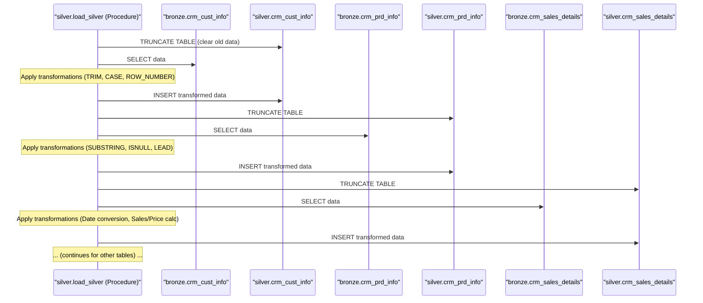
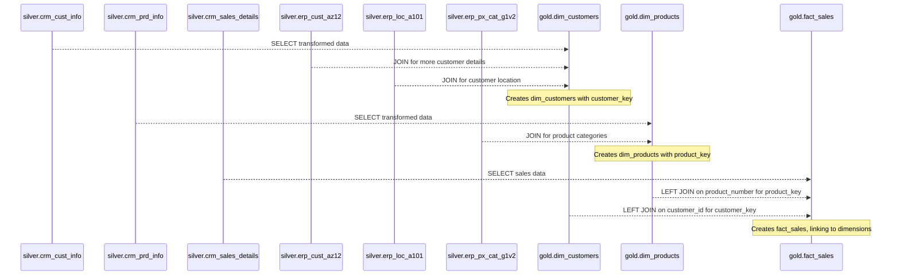
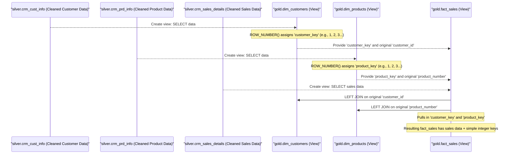
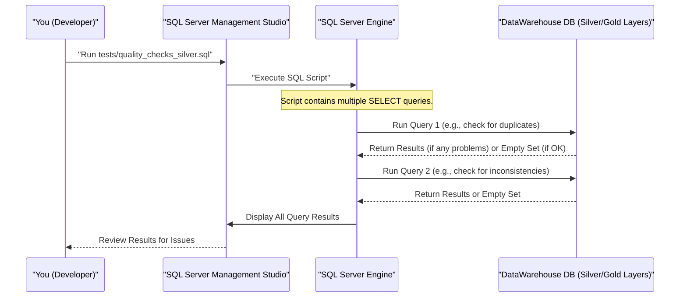

# Tutorial: SQL_Data_Warehouse_Project

This project builds a **modern data warehouse** following a *Medallion Architecture* (Bronze, Silver, Gold layers) to consolidate sales data. It utilizes **ETL pipelines** to extract raw data, perform *cleansing and transformations*, and then load it into a structured **Star Schema** for easy reporting and *business intelligence*. The ultimate goal is to provide reliable data for *actionable insights* into customer behavior, product performance, and sales trends.


## Chapters

1. [Data Warehouse Medallion Architecture
](01_data_warehouse_medallion_architecture_.md)
2. [Database and Schema Initialization
](02_database_and_schema_initialization_.md)
3. [ETL Pipelines (Extract, Transform, Load)
](03_etl_pipelines__extract__transform__load__.md)
4. [Data Cleansing and Transformation
](04_data_cleansing_and_transformation_.md)
5. [Star Schema Data Model
](05_star_schema_data_model_.md)
6. [Surrogate Keys
](06_surrogate_keys_.md)
7. [Data Quality Checks
](07_data_quality_checks_.md)

-------------------------------------------------------------------------------------------------------------------------


# Chapter 1: Data Warehouse Medallion Architecture

Welcome to your journey into building a powerful data warehouse! In this first chapter, we'll explore a fundamental concept that helps organize our data effectively: the **Data Warehouse Medallion Architecture**.

### The Problem We're Solving

Imagine you have lots of raw information coming from different places – maybe sales records from one system and customer details from another. This data is often messy, unorganized, and not ready for quick reports or smart business decisions. For example, some customer names might be misspelled, or product categories might be inconsistent. How do you turn this "data chaos" into clear, trustworthy information that everyone in the business can easily use?

This is where the Medallion Architecture comes in! It provides a structured way to process and refine data, ensuring it's clean, reliable, and easy to use for reporting and analysis. Think of it like a carefully designed factory for data.

### What is the Medallion Architecture?

The Medallion Architecture is a design pattern for data warehouses that organizes data into three distinct layers, or "zones," based on their quality and refinement level. We like to use the analogy of a **data refinery**:

#### 1. Bronze Layer: The Raw Material (Crude Oil)

*   **Description**: This is the very first stop for your data. It holds raw, untouched data exactly as it arrived from the source systems (like your sales system or customer system). No changes, no cleaning, just a pure copy.
*   **Purpose**: To keep an exact, unalterable record of the original data. This is great for auditing and if you ever need to go back to the source.
*   **Analogy**: Think of it as **crude oil** straight from the ground. It's valuable, but it's not ready for use yet.

In our project, when we get data from CSV files, the first thing we do is load it into the Bronze layer.

#### 2. Silver Layer: The Refined Data (Refined Oil)

*   **Description**: In this layer, the raw data from Bronze gets cleaned, standardized, and combined. We fix errors, remove duplicates, and ensure everything is in a consistent format.
*   **Purpose**: To create a single source of truth with high-quality, consistent data. This data is ready for more complex transformations.
*   **Analogy**: This is like taking that crude oil and **refining it** – removing impurities, sorting it, and making it much more usable.

For our project, data from different raw tables in Bronze will be brought together, cleaned, and organized in the Silver layer.

#### 3. Gold Layer: The Business-Ready Products (Finished Products)

*   **Description**: This is the final layer where data is specifically prepared for business users, reports, and dashboards. It's often modeled into easy-to-understand structures like a Star Schema Data Model that make querying and analysis very simple.
*   **Purpose**: To provide a highly optimized, business-friendly view of the data for quick insights and decision-making.
*   **Analogy**: This is the **finished product** – like gasoline for cars or plastic for manufacturing – ready for immediate use.

In our project, the Gold layer will contain special "views" (like virtual tables) that combine our clean data into structures perfect for answering business questions about sales and customers.

### Why Do We Use It?

The Medallion Architecture helps us solve our "data chaos" problem by:

*   **Ensuring Data Quality**: Each layer improves the data, from raw to highly refined.
*   **Providing Reliability**: We always have the original data (Bronze) to fall back on if anything goes wrong.
*   **Making Data Accessible**: Business users get data in an easy-to-understand format (Gold), without needing to worry about the messy details.

### How it Works in Our Project

In our `SQL_Data_Warehouse_Project`, we will follow these steps:

1.  **Start the Refinery**: First, we'll set up our database and create the "containers" for each layer (Bronze, Silver, Gold).
2.  **Ingest Raw Data (Bronze)**: We'll take our raw CSV files (like `crm_cust_info.csv` or `erp_loc_a101.csv`) and load them directly into tables in our `bronze` schema.
3.  **Clean and Prepare (Silver)**: Next, we'll take the data from the `bronze` tables, clean it up, and combine related information. This prepared data will go into tables in our `silver` schema.
4.  **Model for Business (Gold)**: Finally, we'll take the clean data from the `silver` tables and transform it into easy-to-use structures (called "dimensions" and "facts") in our `gold` schema. These structures are perfect for creating reports about customer behavior, product performance, and sales trends.

Let's look at how we prepare our database for these layers.

### Setting Up Our Data Layers

Before we can load any data, we need to create our database and the `bronze`, `silver`, and `gold` schemas within it. Think of schemas as folders within your database that help keep things organized.

We use a SQL script called `init_database.sql` to do this.

```sql
-- scripts/init_database.sql
USE master;
GO

-- Drop and recreate the 'DataWarehouse' database
IF EXISTS (SELECT 1 FROM sys.databases WHERE name = 'DataWarehouse')
BEGIN
    ALTER DATABASE DataWarehouse SET SINGLE_USER WITH ROLLBACK IMMEDIATE;
    DROP DATABASE DataWarehouse;
END;
GO

-- Create the 'DataWarehouse' database
CREATE DATABASE DataWarehouse;
GO

USE DataWarehouse;
GO

-- Create Schemas for Bronze, Silver, Gold layers
CREATE SCHEMA bronze;
GO

CREATE SCHEMA silver;
GO

CREATE SCHEMA gold;
GO
```

**What this code does:**

1.  It checks if a database named `DataWarehouse` already exists. If it does, it deletes it and creates a fresh one. **Be careful: this means any old data will be removed!**
2.  It creates the `DataWarehouse` database itself.
3.  Then, inside this new database, it creates three separate schemas: `bronze`, `silver`, and `gold`. These schemas act as the designated areas for each stage of our data refinery.

Once these schemas are set up, we can start defining the tables (or views) for each layer.

#### Bronze Layer Tables (DDL)

For the Bronze layer, we create tables that exactly match the structure of our raw source files. For example, if we have customer information from a CRM system, we'd create a table like `crm_cust_info` in the `bronze` schema.

Here’s a snippet from `scripts/bronze/ddl_bronze.sql` showing how we define a Bronze table:

```sql
-- scripts/bronze/ddl_bronze.sql
IF OBJECT_ID('bronze.crm_cust_info', 'U') IS NOT NULL
    DROP TABLE bronze.crm_cust_info;
GO

CREATE TABLE bronze.crm_cust_info (
    cst_id              INT,
    cst_key             NVARCHAR(50),
    cst_firstname       NVARCHAR(50),
    cst_lastname        NVARCHAR(50),
    cst_marital_status  NVARCHAR(50),
    cst_gndr            NVARCHAR(50),
    cst_create_date     DATE
);
GO
-- ... similar tables for other raw data sources ...
```

**What this code does:**

1.  It checks if `bronze.crm_cust_info` table already exists. If yes, it drops it so we can create a fresh one.
2.  `CREATE TABLE bronze.crm_cust_info (...)` then defines a new table named `crm_cust_info` inside the `bronze` schema.
3.  The columns (like `cst_id`, `cst_firstname`) match the columns in our raw data files. This table will simply hold the "as-is" raw customer data.

#### Silver Layer Tables (DDL)

After loading into Bronze, we move to the Silver layer. Here, we create tables that will hold the *cleaned* and *standardized* versions of our data. The structure might be similar to Bronze, but the *data inside* will be much cleaner. We also often add a special column, `dwh_create_date`, to track when the data was processed into this layer.

Here’s a snippet from `scripts/silver/ddl_silver.sql` for the Silver customer information table:

```sql
-- scripts/silver/ddl_silver.sql
IF OBJECT_ID('silver.crm_cust_info', 'U') IS NOT NULL
    DROP TABLE silver.crm_cust_info;
GO

CREATE TABLE silver.crm_cust_info (
    cst_id             INT,
    cst_key            NVARCHAR(50),
    cst_firstname      NVARCHAR(50),
    cst_lastname       NVARCHAR(50),
    cst_marital_status NVARCHAR(50),
    cst_gndr           NVARCHAR(50),
    cst_create_date    DATE,
    dwh_create_date    DATETIME2 DEFAULT GETDATE() -- Added column for tracking!
);
GO
-- ... similar tables for other cleaned data ...
```

**What this code does:**

1.  Similar to Bronze, it drops the table if it exists.
2.  It creates the `crm_cust_info` table in the `silver` schema.
3.  Notice the `dwh_create_date DATETIME2 DEFAULT GETDATE()` column. This "technical column" (following our [Naming Conventions](docs/naming_conventions.md)) automatically records the time when each row was inserted into this Silver table, which is very useful for tracking.

#### Gold Layer Views (DDL)

The Gold layer is a bit different. Instead of creating physical tables, we often create "views." A view is like a virtual table that shows you data from other tables, but it doesn't store the data itself. It's like a pre-written query that always gives you the latest, most business-ready information. These views follow our [Naming Conventions](docs/naming_conventions.md) and start with `dim_` for dimension tables or `fact_` for fact tables.

Here’s a snippet from `scripts/gold/ddl_gold.sql` showing how we create a Gold layer view for customers:

```sql
-- scripts/gold/ddl_gold.sql
IF OBJECT_ID('gold.dim_customers', 'V') IS NOT NULL
    DROP VIEW gold.dim_customers;
GO

CREATE VIEW gold.dim_customers AS
SELECT
    ROW_NUMBER() OVER (ORDER BY cst_id) AS customer_key, -- Surrogate key
    ci.cst_id                          AS customer_id,
    ci.cst_key                         AS customer_number,
    ci.cst_firstname                   AS first_name,
    ci.cst_lastname                    AS last_name,
    la.cntry                           AS country,
    ci.cst_marital_status              AS marital_status,
    -- ... more logic to combine and refine gender ...
    ca.bdate                           AS birthdate,
    ci.cst_create_date                 AS create_date
FROM silver.crm_cust_info ci
LEFT JOIN silver.erp_cust_az12 ca
    ON ci.cst_key = ca.cid
LEFT JOIN silver.erp_loc_a101 la
    ON ci.cst_key = la.cid;
GO
-- ... similar views for products (dim_products) and sales (fact_sales) ...
```

**What this code does:**

1.  It checks if a view named `gold.dim_customers` exists. If yes, it drops it.
2.  `CREATE VIEW gold.dim_customers AS SELECT ...` defines a new view called `dim_customers` in the `gold` schema.
3.  The `SELECT` statement pulls data from *multiple* `silver` tables (`silver.crm_cust_info`, `silver.erp_cust_az12`, `silver.erp_loc_a101`), combines them, and renames columns to be more business-friendly (e.g., `cst_id` becomes `customer_id`).
4.  It also generates a `customer_key`, which is a special type of identifier called a Surrogate Key that we will learn more about later.

This view provides a complete and easy-to-use customer table for reports, without storing any duplicate data.

### The Data Flow in a Medallion Architecture

Let's visualize how data moves through these layers in our data refinery:



### Comparing the Layers

Here's a quick summary of each layer:

| Feature           | Bronze Layer                                | Silver Layer                                   | Gold Layer                                  |
| :---------------- | :------------------------------------------ | :--------------------------------------------- | :------------------------------------------ |
| **Purpose**       | Store raw, untouched data                   | Clean, standardize, combine data               | Provide business-ready, modeled data        |
| **Data State**    | Raw, original format                        | Cleaned, consistent, integrated                | Highly refined, aggregated, easy to query   |
| **Data Type**     | All historical and current raw data         | Single source of truth                         | Specific for reporting and analytics        |
| **Example Usage** | Auditing, re-processing if needed           | Feature engineering, complex data transformations | Dashboards, BI tools, strategic decisions   |
| **Analogy**       | Crude Oil                                   | Refined Oil                                    | Finished Products (Gasoline, Plastic)       |

### Conclusion

The Medallion Architecture is a powerful way to structure our data warehouse project. By dividing data processing into Bronze (raw), Silver (cleaned), and Gold (business-ready) layers, we ensure data quality, reliability, and ease of use. This foundation is crucial for turning raw data into valuable insights.

In the next chapter, we will dive deeper into the first step of our project:[Database and Schema Initialization, where we'll set up the environment for our Medallion Architecture.

---

(https://github.com/ArbazAShaikh/SQL_Data_Warehouse_Project/blob/6829c14c80c12b94c7c672dc7f8998977c8edaa2/README.md), [[2]](https://github.com/ArbazAShaikh/SQL_Data_Warehouse_Project/blob/6829c14c80c12b94c7c672dc7f8998977c8edaa2/docs/data_catalog.md), [[3]](https://github.com/ArbazAShaikh/SQL_Data_Warehouse_Project/blob/6829c14c80c12b94c7c672dc7f8998977c8edaa2/docs/naming_conventions.md), [[4]](https://github.com/ArbazAShaikh/SQL_Data_Warehouse_Project/blob/6829c14c80c12b94c7c672dc7f8998977c8edaa2/scripts/bronze/ddl_bronze.sql), [[5]](https://github.com/ArbazAShaikh/SQL_Data_Warehouse_Project/blob/6829c14c80c12b94c7c672dc7f8998977c8edaa2/scripts/gold/ddl_gold.sql), [[6]](https://github.com/ArbazAShaikh/SQL_Data_Warehouse_Project/blob/6829c14c80c12b94c7c672dc7f8998977c8edaa2/scripts/init_database.sql), [[7]](https://github.com/ArbazAShaikh/SQL_Data_Warehouse_Project/blob/6829c14c80c12b94c7c672dc7f8998977c8edaa2/scripts/silver/ddl_silver.sql)</sup></sub>


--------------------------------------------------------------------------------------------------------------------------


# Chapter 2: Database and Schema Initialization

Welcome back! In [Chapter 1: Data Warehouse Medallion Architecture](01_data_warehouse_medallion_architecture_.md), we explored how to logically organize our data into `bronze`, `silver`, and `gold` layers – like a data refinery. But how do we actually *build* this refinery? Where do these layers physically live?

That's exactly what we'll tackle in this chapter: **Database and Schema Initialization**. This is the critical first step to setting up our data warehouse environment.

### Preparing the Foundation for Our Data House

Imagine you're building a new house. Before you can bring in furniture, paint the walls, or even pour concrete for the kitchen, you need to prepare the land, lay the foundation, and then build the actual structure with different rooms.

Our data warehouse is just like that house!

*   **The Problem**: We can't just dump data anywhere. We need a dedicated, structured place for it. We need a "house" (our database) and distinct "rooms" (our schemas) for our raw, cleaned, and business-ready data, as defined by the Medallion Architecture.
*   **The Solution**: We'll create the main container (the database) and then carve out specific, organized areas within it (the schemas). This ensures everything has its proper place from the very beginning.

### What is a Database? (The Whole House)

At its core, a **database** is like the entire house. It's the top-level container that holds *all* your data, tables, views, and other related objects for a specific project or application. For our project, we'll create one main database to hold our entire data warehouse.

Think of it as your big, dedicated folder on a computer where you keep everything related to your "DataWarehouse Project."

### What is a Schema? (The Rooms Within the House)

Within your database (the house), you need different rooms for different purposes, right? You have a kitchen, a living room, bedrooms. In a database, these "rooms" are called **schemas**.

A **schema** is a way to logically group related objects (like tables and views) inside a database. It helps keep your database organized, tidy, and secure.

For our [Data Warehouse Medallion Architecture](01_data_warehouse_medallion_architecture_.md), schemas are perfect for defining our layers:

*   `bronze` schema: This will be our "raw data storage room."
*   `silver` schema: This will be our "cleaned and refined data preparation room."
*   `gold` schema: This will be our "business-ready data display room."

This clear separation makes it easy to understand where data is in its processing journey and prevents clutter.

### Setting Up Our Data Warehouse Foundation

To create our database and schemas, we use a special script written in SQL (Structured Query Language). SQL is the language databases understand.

We have a script called `scripts/init_database.sql` that does exactly this. Let's look at it piece by piece.

#### 1. Connecting to the Master Database

First, we need to tell our SQL Server where to perform these operations. There's a special database called `master` that manages all other databases.

```sql
-- scripts/init_database.sql (part 1)
USE master;
GO
```

**What this code does:**
- `USE master;` tells SQL Server: "Hey, for the next commands, let's work within the `master` database." This is like saying, "Go to the main control panel of our database system."
- `GO` is a command separator, telling the SQL Server to execute the batch of commands up to this point.

#### 2. Cleaning Up (If Needed)

If you've run this project before, the `DataWarehouse` database might already exist. To ensure a fresh start every time, our script checks for its existence and, if found, deletes it.

```sql
-- scripts/init_database.sql (part 2)
-- Drop and recreate the 'DataWarehouse' database
IF EXISTS (SELECT 1 FROM sys.databases WHERE name = 'DataWarehouse')
BEGIN
    ALTER DATABASE DataWarehouse SET SINGLE_USER WITH ROLLBACK IMMEDIATE;
    DROP DATABASE DataWarehouse;
END;
GO
```

**WARNING:** This part of the script will **permanently delete** any existing `DataWarehouse` database and all its data! Be careful when running this in a real project.

**What this code does:**
- `IF EXISTS (...)` checks if a database named `DataWarehouse` already exists.
- If it does, `ALTER DATABASE ... SET SINGLE_USER ...` temporarily kicks out any other users (to ensure we can delete it safely).
- `DROP DATABASE DataWarehouse;` then removes the entire database. This is like demolishing an old house to build a new one on the same plot.

#### 3. Creating Our New Data Warehouse Database

Now that we've ensured a clean slate, we can create our main database.

```sql
-- scripts/init_database.sql (part 3)
-- Create the 'DataWarehouse' database
CREATE DATABASE DataWarehouse;
GO
```

**What this code does:**
- `CREATE DATABASE DataWarehouse;` is the command to build our new "house" called `DataWarehouse`.

#### 4. Switching to Our New Database

After creating it, we need to tell SQL Server to start working inside our new `DataWarehouse` database.

```sql
-- scripts/init_database.sql (part 4)
USE DataWarehouse;
GO
```

**What this code does:**
- `USE DataWarehouse;` tells SQL Server: "Okay, now switch our focus to the `DataWarehouse` database. All subsequent commands should apply here." This is like entering the new house.

#### 5. Creating Our Medallion Schemas

Finally, we create our `bronze`, `silver`, and `gold` "rooms" inside our `DataWarehouse` "house."

```sql
-- scripts/init_database.sql (part 5)
-- Create Schemas
CREATE SCHEMA bronze;
GO

CREATE SCHEMA silver;
GO

CREATE SCHEMA gold;
GO
```

**What this code does:**
- `CREATE SCHEMA bronze;` creates a new schema named `bronze` within the `DataWarehouse` database. This is our dedicated "raw data room."
- Similarly, `CREATE SCHEMA silver;` and `CREATE SCHEMA gold;` create the other two important rooms for our refined and business-ready data.

### How It Works Under the Hood

When you run the `init_database.sql` script, here's a simplified view of what happens:

```mermaid
sequenceDiagram
    participant You as "You (Developer)"
    participant SSMS as "SQL Server Management Studio"
    participant SQLS as "SQL Server Engine"
    participant MD as "Master Database"
    participant DWH as "DataWarehouse Database"

    You->>SSMS: "Run scripts/init_database.sql"
    SSMS->>SQLS: "Execute SQL Script"
    SQLS->>MD: "1. USE master;"
    SQLS->>MD: "2. Check/Drop/Create DataWarehouse DB"
    Note over SQLS,MD: SQL Server creates the main database.
    SQLS->>DWH: "3. USE DataWarehouse;"
    SQLS->>DWH: "4. Create bronze schema"
    SQLS->>DWH: "5. Create silver schema"
    SQLS->>DWH: "6. Create gold schema"
    Note over SQLS,DWH: Schemas are created inside the new database.
    DWH-->>SQLS: Initialization Complete
    SQLS-->>SSMS: Success
    SSMS-->>You: "Database and schemas ready!"
```

In summary: You tell your SQL tool to run the script. The SQL tool sends these commands to the SQL Server engine. The engine first interacts with the `master` database to manage the creation/deletion of our main `DataWarehouse` database. Once `DataWarehouse` is ready, the engine switches its focus to it and creates the `bronze`, `silver`, and `gold` schemas inside.

### Database vs. Schema: A Quick Comparison

Here's a recap of the differences using our house analogy:

| Feature           | Database                                | Schema                                  |
| :---------------- | :-------------------------------------- | :-------------------------------------- |
| **Analogy**       | The entire house                        | A specific room within the house        |
| **Purpose**       | Main container for all data             | Logical grouping of objects within a DB |
| **What it holds** | Schemas, tables, views, stored procs    | Tables, views, functions                |
| **Example**       | `DataWarehouse`                         | `bronze`, `silver`, `gold`              |

### Conclusion

Congratulations! You've just learned how to prepare the foundation and structure for your data warehouse. By running `scripts/init_database.sql`, you create the main `DataWarehouse` database and its essential `bronze`, `silver`, and `gold` schemas. This setup provides a clean, organized environment, ready to receive and process data according to our [Data Warehouse Medallion Architecture](01_data_warehouse_medallion_architecture_.md).

Now that our "data house" is built and its "rooms" are defined, the next exciting step is to actually bring data into it. In the next chapter, we'll dive into **[ETL Pipelines (Extract, Transform, Load)](03_etl_pipelines__extract__transform__load__.md)**, where we'll learn how to get raw data from its sources and load it into our `bronze` layer.

---

(https://github.com/ArbazAShaikh/SQL_Data_Warehouse_Project/blob/6829c14c80c12b94c7c672dc7f8998977c8edaa2/scripts/init_database.sql)</sup></sub>


# Chapter 3: ETL Pipelines (Extract, Transform, Load)

Welcome back, future data wizard! In [Chapter 1: Data Warehouse Medallion Architecture](01_data_warehouse_medallion_architecture_.md), we learned about the different layers of our data refinery (Bronze, Silver, Gold). Then, in [Chapter 2: Database and Schema Initialization](02_database_and_schema_initialization_.md), we physically built our "data house" and created these layers as schemas in our database.

Now that our house is built and the rooms are ready, how do we get data into it? And once it's in the `bronze` (raw) room, how do we move it to the `silver` (cleaned) room, refining it along the way?

### The Data's Journey: Why ETL is Essential

Imagine you have raw ingredients (our source data from CSV files) and you want to make a gourmet meal (our business-ready data in the Gold layer). You can't just throw raw ingredients on a plate! You need to:

1.  **Pick the ingredients** (get the raw data).
2.  **Prepare and cook them** (clean, transform, and combine the data).
3.  **Serve the finished meal** (load the prepared data into its final destination).

This entire process of moving and preparing data is exactly what **ETL Pipelines** do. ETL stands for **Extract, Transform, Load**, and it's the heartbeat of any data warehouse. It's how we turn messy, raw data into clean, valuable information for analysis.

**The Problem**: Our raw data sources (like `cust_info.csv` or `sales_details.csv`) are often external files or different systems. This data might have errors, inconsistent formats, or missing values. We need a way to reliably pull this data in, clean it up, and organize it into our data warehouse layers.

**The Solution**: ETL pipelines automate this entire journey. They ensure data flows smoothly from its original source, through our Bronze and Silver layers, becoming more refined and useful at each step.

### Understanding the Three Steps: E, T, and L

Let's break down each part of the ETL process:

#### 1. E: Extract (Picking Ingredients)

The "Extract" step is about pulling raw data from its original source. This source could be a CSV file, another database, a website, or an application. The goal is to get the data "as-is" without making any changes to it yet.

In our project, our sources are CSV files located in the `datasets/` folder. The "Extract" phase means reading these files.

#### 2. T: Transform (Preparing and Cooking Ingredients)

The "Transform" step is where the real magic happens! This is where you clean, reshape, combine, and enrich your data to make it useful for analysis. Think of all the steps you take when cooking:
*   **Cleaning**: Removing dirt from vegetables (e.g., fixing misspellings, removing duplicates, handling missing values).
*   **Reshaping**: Chopping vegetables into smaller pieces (e.g., changing data types, splitting columns, reformatting dates).
*   **Combining**: Mixing different ingredients together (e.g., joining data from multiple source tables).

This is the most crucial step, ensuring data quality and consistency.

#### 3. L: Load (Serving the Finished Meal)

The "Load" step is about placing the prepared data into its final destination. In our data warehouse, this means inserting data into the appropriate tables within our `bronze`, `silver`, or `gold` schemas.

The `bronze` layer receives the raw, extracted data. The `silver` layer receives the transformed and cleaned data from the `bronze` layer. The `gold` layer receives the fully refined, business-ready data from the `silver` layer.

### ETL in Action: From Raw CSV to Cleaned Silver Data

Let's see how these steps work in our project using SQL stored procedures. Stored procedures are like pre-written sets of SQL commands that you can run whenever you need to perform a specific task. They help automate our ETL process.

#### Step 1: Extract and Load into Bronze Layer

First, we need to get our raw CSV data into the `bronze` schema. We use a stored procedure called `bronze.load_bronze` for this.

**How it works**:
This procedure reads each CSV file and uses a special SQL command called `BULK INSERT` to quickly load all the data directly into its corresponding table in the `bronze` schema. Before loading, it also `TRUNCATE`s (empties) the table to ensure we always start with fresh data.

Here's a simplified look at how `bronze.load_bronze` handles the `crm_cust_info.csv` file:

```sql
-- scripts/bronze/proc_load_bronze.sql (excerpt)
TRUNCATE TABLE bronze.crm_cust_info;

BULK INSERT bronze.crm_cust_info
FROM 'C:\sql\dwh_project\datasets\source_crm\cust_info.csv'
WITH (
    FIRSTROW = 2,
    FIELDTERMINATOR = ',',
    TABLOCK
);
-- ... similar blocks for other raw CSV files ...
```

**What this code does**:
*   `TRUNCATE TABLE bronze.crm_cust_info;`: This command empties all existing data from the `crm_cust_info` table in the `bronze` schema, preparing it for new data.
*   `BULK INSERT bronze.crm_cust_info ...`: This powerful command reads the data from the specified CSV file (`cust_info.csv`) and inserts it rapidly into the `bronze.crm_cust_info` table.
    *   `FROM '...'`: Specifies the exact path to your CSV file. **(You might need to adjust this path to match where you've saved the project datasets on your computer!)**
    *   `FIRSTROW = 2`: Tells SQL Server to skip the first row of the CSV (which usually contains column headers).
    *   `FIELDTERMINATOR = ','`: Tells SQL Server that commas separate values in the CSV file.
    *   `TABLOCK`: Helps speed up the loading process.

After running `EXEC bronze.load_bronze;`, your `bronze` tables will contain exact copies of the raw data from your CSV files.

#### Step 2: Extract, Transform, and Load into Silver Layer

Once the raw data is in the `bronze` layer, the next step is to move it to the `silver` layer, cleaning and transforming it along the way. This is handled by the `silver.load_silver` stored procedure.

**How it works**:
This procedure performs "Extract" by selecting data from the `bronze` tables. Then, it "Transforms" this data using various SQL functions to clean and standardize it. Finally, it "Loads" the refined data into the corresponding tables in the `silver` schema.

Here's a simplified example of how `silver.load_silver` transforms `bronze.crm_cust_info` and loads it into `silver.crm_cust_info`:

```sql
-- scripts/silver/proc_load_silver.sql (simplified excerpt)
TRUNCATE TABLE silver.crm_cust_info;

INSERT INTO silver.crm_cust_info (
    cst_id, cst_firstname, cst_marital_status -- Example target columns
)
SELECT
    cst_id,
    TRIM(cst_firstname), -- Remove extra spaces (Transformation: Cleaning)
    CASE
        WHEN cst_marital_status = 'S' THEN 'Single'
        WHEN cst_marital_status = 'M' THEN 'Married'
        ELSE 'Unknown'
    END AS marital_status -- Standardize values (Transformation: Reshaping)
FROM bronze.crm_cust_info; -- Data source is the Bronze layer (Extraction)
-- ... more transformations for other tables follow ...
```

**What this code does**:
*   `TRUNCATE TABLE silver.crm_cust_info;`: Similar to the bronze load, this empties the `silver` table to prepare for fresh, cleaned data.
*   `INSERT INTO silver.crm_cust_info (...) SELECT ... FROM bronze.crm_cust_info;`: This is the core ETL operation.
    *   **Extract**: The `FROM bronze.crm_cust_info` part extracts data from our `bronze` layer.
    *   **Transform**:
        *   `TRIM(cst_firstname)`: This function removes any accidental spaces from the beginning or end of the customer's first name, making the data cleaner.
        *   `CASE WHEN cst_marital_status = 'S' THEN 'Single' ... END`: This `CASE` statement takes raw marital status codes (like 'S' for single, 'M' for married) and converts them into more readable, standardized descriptions ('Single', 'Married', 'Unknown'). This is crucial for consistent reporting.
    *   **Load**: The `INSERT INTO silver.crm_cust_info` command takes the results of the `SELECT` query (the transformed data) and loads it into the `silver.crm_cust_info` table.

This transformation ensures that the data in your `silver` layer is much more reliable and easier to use than the raw data in `bronze`.

### How ETL Works Under the Hood

Let's visualize the journey of a single piece of customer data from a raw CSV file all the way to our cleaned Silver layer:



1.  **Raw Data In (CSV File)**: Our customer data starts in a `cust_info.csv` file.
2.  **Bronze Extraction & Loading**: The `bronze.load_bronze` procedure reads this CSV (Extract) and uses `BULK INSERT` to load it directly into `bronze.crm_cust_info` (Load). At this stage, no changes are made to the data.
3.  **Silver Extraction**: The `silver.load_silver` procedure then `SELECT`s data from `bronze.crm_cust_info` (Extract).
4.  **Silver Transformation**: While selecting, SQL functions like `TRIM` and `CASE WHEN` are applied to clean and standardize the data, making it more consistent and readable.
5.  **Silver Loading**: Finally, the transformed data is `INSERT`ed into `silver.crm_cust_info` (Load), ready for further use.

These two stored procedures, `bronze.load_bronze` and `silver.load_silver`, automate this entire process for all our source tables, making our data refinery run smoothly.

### Summary: The Power of ETL

| ETL Step  | Purpose                                   | Analogy                    | Action in Project                                                                 |
| :-------- | :---------------------------------------- | :------------------------- | :-------------------------------------------------------------------------------- |
| **Extract** | Pull raw data from sources                | Picking ingredients        | Reading CSV files (`BULK INSERT`) or `SELECT`ing from Bronze tables             |
| **Transform** | Clean, refine, combine, and reshape data  | Preparing/cooking ingredients | SQL functions like `TRIM`, `CASE WHEN`, `JOIN`s to standardize and clean data |
| **Load**  | Place data into its destination             | Serving the meal           | `BULK INSERT` into Bronze, `INSERT INTO` into Silver                              |

ETL pipelines are the backbone of our data warehouse. They ensure that data is not just moved, but also improved, making it reliable and valuable for business decisions.

### Conclusion

You've now learned about ETL pipelines – the critical process that extracts raw data, transforms it into a clean and usable format, and loads it into our data warehouse layers. We saw how this journey begins with raw CSV files moving into our `bronze` schema, and then how data is refined and loaded into our `silver` schema. This automated process is essential for maintaining data quality and consistency.

While we've touched upon some basic transformations, the next chapter will dive deeper into **[Data Cleansing and Transformation](04_data_cleansing_and_transformation_.md)**, exploring more advanced techniques to make our data truly shine!

---

(https://github.com/ArbazAShaikh/SQL_Data_Warehouse_Project/blob/6829c14c80c12b94c7c672dc7f8998977c8edaa2/README.md), [[2]](https://github.com/ArbazAShaikh/SQL_Data_Warehouse_Project/blob/6829c14c80c12b94c7c672dc7f8998977c8edaa2/scripts/bronze/ddl_bronze.sql), [[3]](https://github.com/ArbazAShaikh/SQL_Data_Warehouse_Project/blob/6829c14c80c12b94c7c672dc7f8998977c8edaa2/scripts/bronze/proc_load_bronze.sql), [[4]](https://github.com/ArbazAShaikh/SQL_Data_Warehouse_Project/blob/6829c14c80c12b94c7c672dc7f8998977c8edaa2/scripts/silver/ddl_silver.sql), [[5]](https://github.com/ArbazAShaikh/SQL_Data_Warehouse_Project/blob/6829c14c80c12b94c7c672dc7f8998977c8edaa2/scripts/silver/proc_load_silver.sql)</sup></sub>


# Chapter 4: Data Cleansing and Transformation

Welcome back! In [Chapter 3: ETL Pipelines (Extract, Transform, Load)](03_etl_pipelines__extract__transform__load__.md), we learned how to get raw data from our source files into our `bronze` layer and then how to move it to the `silver` layer, performing some basic transformations along the way. We saw that the "T" in ETL, **Transform**, is where we start refining our data.

This chapter is all about diving deeper into that "Transform" stage, focusing specifically on **Data Cleansing and Transformation**. This is where we truly turn messy, raw data into sparkling, reliable information!

### The Problem: Messy Data!

Imagine you're trying to bake a cake, but your ingredients are a bit... chaotic. The flour has clumps, the eggs are cracked, and the sugar has some dirt in it. If you just throw everything into the bowl, your cake won't turn out well, right?

The same goes for data! Raw data from different source systems often comes with problems:
*   **Inconsistencies:** One system might record gender as 'M' or 'F', while another uses 'Male' or 'Female'. Or countries might be 'USA', 'US', or 'United States'.
*   **Errors:** A customer's birthdate might be in the future, or a product's cost might be negative.
*   **Missing Values:** Important fields like a product's price or a customer's marital status might be empty.
*   **Messy Formats:** Dates might be stored as numbers (`20231026`) instead of proper date formats (`2023-10-26`), or text fields might have extra spaces.

If we try to create reports or make business decisions using this messy data, our results will be inaccurate and untrustworthy. This is where Data Cleansing and Transformation comes in!

### What is Data Cleansing and Transformation?

This is like the quality control and preparation stage for our raw data. Just as raw ingredients need to be washed, peeled, and cut before cooking, raw data often contains errors, inconsistencies, or messy formats.

In our data warehouse, especially in the **Silver Layer** (as defined in [Chapter 1: Data Warehouse Medallion Architecture](01_data_warehouse_medallion_architecture_.md)), we fix these issues by:

1.  **Standardizing Values:** Making sure similar data is represented in a consistent way (e.g., 'M' to 'Male', 'US' to 'United States').
2.  **Handling Missing Values:** Deciding how to deal with empty fields (e.g., filling with a default like 'n/a' or 0, or leaving as `NULL`).
3.  **Correcting Errors:** Fixing invalid data entries (e.g., setting future birthdates to `NULL`, recalculating incorrect sales figures).
4.  **Converting Data Types:** Ensuring data is in the correct format for analysis (e.g., converting text-based dates to actual date types).
5.  **Deriving New Information:** Calculating new fields or extracting useful parts from existing data (e.g., getting a product category ID from a product key).
6.  **Removing Duplicates:** Ensuring each unique entity (like a customer) has only one up-to-date record.

The goal is to ensure our data is **clean, accurate, and consistent** for reliable analysis in the [Gold Layer](05_star_schema_data_model_.md).

### How We Clean and Transform Data in Our Project (The Silver Layer)

In our project, the core of data cleansing and transformation happens within the `silver.load_silver` stored procedure, located in `scripts/silver/proc_load_silver.sql`. This procedure takes data from our `bronze` tables and applies a series of SQL commands to clean and reshape it before loading into the `silver` tables.

Let's look at some simplified examples from this procedure to understand the different types of transformations.

#### Example 1: Standardizing and Deduplicating Customer Info (`silver.crm_cust_info`)

Our `bronze.crm_cust_info` table might have customer records with inconsistent gender/marital status codes (like 'M' or 'F', 'S' or 'M') and possibly duplicate records for the same customer.

**Problem:** Inconsistent `cst_gndr` ('F' vs 'Female') and `cst_marital_status` ('S' vs 'Single'). Also, potential duplicate `cst_id`s, where we want the latest record.

**Solution:**
- Use `CASE` statements to standardize `cst_gndr` and `cst_marital_status` to full, readable words.
- Use `TRIM()` to remove any accidental spaces.
- Use `ROW_NUMBER()` to select only the most recent record for each customer.

Here’s a simplified snippet:

```sql
-- From scripts/silver/proc_load_silver.sql
INSERT INTO silver.crm_cust_info (...)
SELECT
    cst_id,
    TRIM(cst_firstname) AS cst_firstname,
    CASE
        WHEN UPPER(TRIM(cst_marital_status)) = 'S' THEN 'Single'
        WHEN UPPER(TRIM(cst_marital_status)) = 'M' THEN 'Married'
        ELSE 'n/a'
    END AS cst_marital_status, -- Standardize marital status
    CASE
        WHEN UPPER(TRIM(cst_gndr)) = 'F' THEN 'Female'
        WHEN UPPER(TRIM(cst_gndr)) = 'M' THEN 'Male'
        ELSE 'n/a'
    END AS cst_gndr -- Standardize gender
FROM (
    SELECT
        *,
        ROW_NUMBER() OVER (PARTITION BY cst_id ORDER BY cst_create_date DESC) AS flag_last
    FROM bronze.crm_cust_info
    WHERE cst_id IS NOT NULL
) t
WHERE flag_last = 1; -- Select the most recent record
```

**What this code does:**
1.  **`TRIM(cst_firstname)`**: Removes any leading or trailing spaces from first names, ensuring cleanliness.
2.  **`CASE WHEN ... END AS cst_marital_status`**: Converts single-letter codes ('S', 'M') into full words ('Single', 'Married') and sets others to 'n/a' (not applicable), making the data more readable and consistent. The `UPPER()` function ensures it handles both 's' and 'S'.
3.  **`CASE WHEN ... END AS cst_gndr`**: Does the same for gender codes.
4.  **`ROW_NUMBER() OVER (PARTITION BY cst_id ORDER BY cst_create_date DESC) AS flag_last`**: This is a powerful technique for deduplication. It assigns a rank to each customer's record, with `1` being the most recent (`ORDER BY cst_create_date DESC`).
5.  **`WHERE flag_last = 1`**: Ensures that only the latest (most up-to-date) record for each unique `cst_id` is loaded into the `silver` table, removing older duplicates.

#### Example 2: Deriving Information and Handling Missing Values for Product Info (`silver.crm_prd_info`)

Our `bronze.crm_prd_info` table might have a combined product key, missing costs, and only a product start date.

**Problem:**
- `prd_key` contains both category and product identifier.
- `prd_cost` might be `NULL`.
- `prd_end_dt` is missing, but we can derive it from the next product version's start date.
- `prd_line` needs to be mapped from codes to descriptions.

**Solution:**
- Use `SUBSTRING` and `REPLACE` to extract `cat_id` and clean `prd_key`.
- Use `ISNULL` to replace `NULL` costs with 0.
- Use `CASE` to map `prd_line` codes.
- Use `LEAD` window function to calculate `prd_end_dt`.

Here’s a simplified snippet:

```sql
-- From scripts/silver/proc_load_silver.sql
INSERT INTO silver.crm_prd_info (...)
SELECT
    prd_id,
    REPLACE(SUBSTRING(prd_key, 1, 5), '-', '_') AS cat_id, -- Derive category ID
    SUBSTRING(prd_key, 7, LEN(prd_key)) AS prd_key,        -- Clean product key
    prd_nm,
    ISNULL(prd_cost, 0) AS prd_cost,                       -- Handle NULL cost
    CASE
        WHEN UPPER(TRIM(prd_line)) = 'M' THEN 'Mountain'
        WHEN UPPER(TRIM(prd_line)) = 'R' THEN 'Road'
        -- ... more mappings ...
        ELSE 'n/a'
    END AS prd_line, -- Map product line codes
    CAST(prd_start_dt AS DATE) AS prd_start_dt,
    CAST(
        LEAD(prd_start_dt) OVER (PARTITION BY prd_key ORDER BY prd_start_dt) - 1
        AS DATE
    ) AS prd_end_dt -- Derive end date
FROM bronze.crm_prd_info;
```

**What this code does:**
1.  **`REPLACE(SUBSTRING(prd_key, 1, 5), '-', '_') AS cat_id`**: Extracts the first 5 characters of `prd_key` (which represents the category) and replaces a hyphen with an underscore, creating a new `cat_id`. This is an example of **deriving new information**.
2.  **`SUBSTRING(prd_key, 7, LEN(prd_key)) AS prd_key`**: Extracts the actual product key part, cleaning it for consistent use.
3.  **`ISNULL(prd_cost, 0) AS prd_cost`**: If `prd_cost` is `NULL` (missing), it replaces it with `0`. This is **handling missing values**.
4.  **`CASE WHEN ... END AS prd_line`**: Standardizes product line codes ('M', 'R') into descriptive names ('Mountain', 'Road').
5.  **`LEAD(prd_start_dt) OVER (PARTITION BY prd_key ORDER BY prd_start_dt) - 1 AS prd_end_dt`**: This clever function looks at the `prd_start_dt` of the *next* record for the *same* product (`PARTITION BY prd_key`) and sets the current record's `prd_end_dt` to one day before that. This helps track the validity period of product versions. This is another example of **derivation**.

#### Example 3: Correcting Dates and Recalculating Sales (`silver.crm_sales_details`)

Sales data often has messy dates and potentially incorrect sales totals.

**Problem:**
- `sls_order_dt`, `sls_ship_dt`, `sls_due_dt` are stored as numbers (e.g., `20231026`) or might be invalid (`0`).
- `sls_sales` might be `NULL`, zero, or incorrect (not equal to `sls_quantity * sls_price`).

**Solution:**
- Use `CASE` statements with `CAST` and `LEN` to convert number-based dates to proper `DATE` types, and set invalid dates to `NULL`.
- Recalculate `sls_sales` if it's invalid.
- Derive `sls_price` if it's invalid.

Here’s a simplified snippet:

```sql
-- From scripts/silver/proc_load_silver.sql
INSERT INTO silver.crm_sales_details (...)
SELECT
    sls_ord_num,
    -- Convert and validate order date
    CASE
        WHEN sls_order_dt = 0 OR LEN(sls_order_dt) != 8 THEN NULL
        ELSE CAST(CAST(sls_order_dt AS VARCHAR) AS DATE)
    END AS sls_order_dt,
    -- Recalculate sales if needed
    CASE
        WHEN sls_sales IS NULL OR sls_sales <= 0 OR sls_sales != sls_quantity * ABS(sls_price)
            THEN sls_quantity * ABS(sls_price)
        ELSE sls_sales
    END AS sls_sales,
    sls_quantity,
    -- Derive price if original value is invalid
    CASE
        WHEN sls_price IS NULL OR sls_price <= 0
            THEN sls_sales / NULLIF(sls_quantity, 0)
        ELSE sls_price
    END AS sls_price
FROM bronze.crm_sales_details;
```

**What this code does:**
1.  **Date Conversion**: The `CASE` statement checks if `sls_order_dt` is `0` or if its length isn't 8 characters (indicating an invalid date format). If so, it sets the date to `NULL`. Otherwise, it `CAST`s the numeric date to a `VARCHAR` and then to a `DATE` type. This is **data type conversion and error correction**.
2.  **Sales Recalculation**: If `sls_sales` is `NULL`, zero, negative, or doesn't match `sls_quantity * ABS(sls_price)`, it recalculates the sales using `sls_quantity * ABS(sls_price)`. This is a crucial **error correction** step to ensure financial data accuracy.
3.  **Price Derivation**: Similarly, if `sls_price` is `NULL` or invalid, it attempts to derive it from `sls_sales / sls_quantity`. `NULLIF(sls_quantity, 0)` prevents division by zero errors. This is **error correction and derivation**.

#### Example 4: Correcting Future Birthdates and Normalizing Gender (`silver.erp_cust_az12`)

Customer data from different ERP systems often has different gender formats and potential data entry errors like future birthdates.

**Problem:**
- `bdate` (birthdate) might be in the future.
- `gen` (gender) might have variations like 'F', 'M', 'FEMALE', 'MALE'.

**Solution:**
- Set future `bdate`s to `NULL`.
- Normalize `gen` values to 'Female', 'Male', or 'n/a'.

Here’s a simplified snippet:

```sql
-- From scripts/silver/proc_load_silver.sql
INSERT INTO silver.erp_cust_az12 (...)
SELECT
    cid,
    CASE
        WHEN bdate > GETDATE() THEN NULL -- Correct future birthdates
        ELSE bdate
    END AS bdate,
    CASE
        WHEN UPPER(TRIM(gen)) IN ('F', 'FEMALE') THEN 'Female'
        WHEN UPPER(TRIM(gen)) IN ('M', 'MALE') THEN 'Male'
        ELSE 'n/a'
    END AS gen -- Normalize gender
FROM bronze.erp_cust_az12;
```

**What this code does:**
1.  **Future Birthdates**: `CASE WHEN bdate > GETDATE() THEN NULL ELSE bdate END` checks if a birthdate is in the future. If so, it's clearly an error, so it's set to `NULL`. This is **error correction**.
2.  **Gender Normalization**: Similar to `crm_cust_info`, it standardizes `gen` values to 'Female', 'Male', or 'n/a', handling multiple input formats.

#### Example 5: Standardizing Country Codes (`silver.erp_loc_a101`)

Location data from another ERP system might use country codes that are not consistent or missing.

**Problem:** `cntry` might be 'DE', 'US', 'USA', or empty.

**Solution:** Normalize country codes to full names and handle missing values.

Here’s a simplified snippet:

```sql
-- From scripts/silver/proc_load_silver.sql
INSERT INTO silver.erp_loc_a101 (...)
SELECT
    REPLACE(cid, '-', '') AS cid, -- Clean CID by removing hyphens
    CASE
        WHEN TRIM(cntry) = 'DE' THEN 'Germany'
        WHEN TRIM(cntry) IN ('US', 'USA') THEN 'United States'
        WHEN TRIM(cntry) = '' OR cntry IS NULL THEN 'n/a'
        ELSE TRIM(cntry)
    END AS cntry -- Normalize country codes
FROM bronze.erp_loc_a101;
```

**What this code does:**
1.  **Clean `cid`**: `REPLACE(cid, '-', '')` removes any hyphens from the customer ID, ensuring a consistent format.
2.  **Country Standardization**: The `CASE` statement maps common country codes ('DE', 'US', 'USA') to their full names ('Germany', 'United States') and assigns 'n/a' to empty or `NULL` entries. This is **standardization and handling missing values**.

### How Data Cleansing and Transformation Works Under the Hood

The `silver.load_silver` stored procedure orchestrates all these transformations. When you execute `EXEC silver.load_silver;`, here's a simplified sequence of events:



1.  **Truncate Silver Tables**: For each `silver` table, the procedure first empties it using `TRUNCATE TABLE`. This ensures that each run of the ETL pipeline starts with a fresh slate and doesn't accumulate old or duplicate data.
2.  **Select from Bronze (Extract)**: For each `silver` table, a `SELECT` query is issued against the corresponding `bronze` table (or sometimes multiple `bronze` tables if data is being combined). This is the "Extract" part of ETL.
3.  **Apply Transformations**: Within each `SELECT` statement, various SQL functions (`TRIM`, `CASE`, `ISNULL`, `SUBSTRING`, `ROW_NUMBER`, `LEAD`, `CAST`, etc.) are applied to the raw data. These functions perform all the cleansing, standardization, error correction, and derivation we discussed. This is the "Transform" part.
4.  **Insert into Silver (Load)**: The results of the transformed `SELECT` query are then `INSERT`ed into the target `silver` table. This is the "Load" part.

This sequence is repeated for every table that needs to be processed from `bronze` to `silver`, ensuring all data is systematically cleaned and prepared.

### The Impact of Cleansing and Transformation

Here's a quick comparison of data before and after cleansing:

| Feature           | Raw Data (Bronze Layer)                     | Cleaned Data (Silver Layer)                           |
| :---------------- | :------------------------------------------ | :---------------------------------------------------- |
| **Gender**        | 'M', 'F', 'male', 'f'                       | 'Male', 'Female', 'n/a'                               |
| **Marital Status**| 'S', 'M', 's'                               | 'Single', 'Married', 'n/a'                            |
| **Birthdate**     | `2050-01-01` (future), `1985-10-26`         | `NULL`, `1985-10-26`                                  |
| **Sales Value**   | `NULL`, `500` (but quantity * price = 450)  | `450` (recalculated and consistent)                   |
| **Country**       | 'US', 'USA', 'Germany', 'DE', '' (empty)    | 'United States', 'Germany', 'n/a'                     |
| **Product Key**   | `PROD-A-001`                                | `001` (extracted clean key), `cat_id = 'PROD_A'`      |

As you can see, the Silver layer data is significantly more reliable, consistent, and ready for accurate analysis.

### Verifying Data Quality

After all these transformations, how do we know our data is truly clean? This is where **Data Quality Checks** come in! We have a script, `tests/quality_checks_silver.sql`, that runs specific queries to verify that our transformations worked as expected. For example, we check for:
*   No future birthdates.
*   Correctly standardized gender/marital status.
*   Sales figures matching quantity * price.
*   No unwanted spaces.

We will explore these checks in more detail in [Chapter 7: Data Quality Checks](07_data_quality_checks_.md).

### Conclusion

You've now gained a deep understanding of Data Cleansing and Transformation, a crucial step in building a reliable data warehouse. By carefully applying various SQL techniques in the Silver layer, we transform raw, messy data into clean, consistent, and accurate information. This prepared data is the foundation for all meaningful business insights.

With our data now cleaned and standardized in the Silver layer, the next exciting step is to organize it into an easy-to-understand structure for business analysis. In the next chapter, we will learn about the **[Star Schema Data Model](05_star_schema_data_model_.md)**.

---

(https://github.com/ArbazAShaikh/SQL_Data_Warehouse_Project/blob/6829c14c80c12b94c7c672dc7f8998977c8edaa2/README.md), [[2]](https://github.com/ArbazAShaikh/SQL_Data_Warehouse_Project/blob/6829c14c80c12b94c7c672dc7f8998977c8edaa2/scripts/silver/proc_load_silver.sql), [[3]](https://github.com/ArbazAShaikh/SQL_Data_Warehouse_Project/blob/6829c14c80c12b94c7c672dc7f8998977c8edaa2/tests/quality_checks_silver.sql)</sup></sub>


# Chapter 5: Star Schema Data Model

Welcome back, data explorer! In [Chapter 4: Data Cleansing and Transformation](04_data_cleansing_and_transformation_.md), we focused on making our raw data clean, consistent, and reliable in the `silver` layer. Now that we have beautifully polished data, the next crucial step is to organize it in a way that makes it incredibly easy and fast for anyone in the business to get insights.

### The Problem: Making Data Easy to Understand and Use

Imagine you've meticulously organized your books by color, size, and publication date. That's great for *you* because you know your system! But what if someone else wants to find all books by "Science Fiction" authors published in the 1990s? They might struggle with your unique system.

Our clean data in the `silver` layer, while perfect for technical transformations, isn't always laid out in the most intuitive way for business users who want to create reports or dashboards. They need a simple, clear map to find answers to questions like:

*   "What were our **total sales amount** for 'Road Bikes' in 'Germany' last quarter?"
*   "Which **customers** bought the most 'Mountain Bikes' last year?"
*   "How many 'Single' **female customers** did we gain in the last month?"

To answer these questions quickly and efficiently, we need a special way to structure our data: the **Star Schema Data Model**.

### What is the Star Schema Data Model?

Picture a star-shaped map of your business. At the center of this star is a "fact" table, holding all the numerical measurements or "facts" that you want to analyze (like sales amounts, quantities, or profits). Radiating out from it are "dimension" tables, which provide descriptive context for those measurements (e.g., who the customer is, what product was sold, when the sale occurred).

This model is like having a perfectly organized menu (the dimension tables) around your main dish (the fact table). It makes it super easy to "slice and dice" your data – meaning you can look at your sales by product, by customer, by date, or any combination, very quickly.

#### 1. The Fact Table: The Center of the Star (Your Core Business Metrics)

The **fact table** is the heart of your star schema. It contains the numerical measurements (called "facts" or "measures") that you want to analyze, along with "keys" that link it to the surrounding dimension tables.

*   **What it holds**: Numbers! Things you can sum, count, or average. For example, `sales_amount`, `quantity`, `price`.
*   **Analogy**: Think of it as the **scorecard** of your business. It records *what happened* (e.g., "1 Road Bike was sold for $500").
*   **Example in our project**: `gold.fact_sales`

#### 2. Dimension Tables: The Points of the Star (Descriptive Context)

**Dimension tables** surround the fact table and provide all the descriptive attributes (text-based information) that give context to your facts. They answer "who, what, where, when, why, and how."

*   **What it holds**: Descriptions! Things like `customer_name`, `product_category`, `country`, `order_date`.
*   **Analogy**: These are the **details** that explain the scorecard. For example, "who bought it (customer details), what exactly was sold (product details), and when it happened (date details)."
*   **Example in our project**: `gold.dim_customers`, `gold.dim_products`

### How They Connect: Keys!

Dimension tables connect to the fact table using special columns called **keys**.

*   Each dimension table has a unique identifier for each of its rows. This is called a **primary key**. In our project, for the Gold layer, these are often special `_key` columns we generate (like `customer_key`, `product_key`). We'll learn more about these in [Chapter 6: Surrogate Keys](06_surrogate_keys_.md).
*   The fact table has columns that match these primary keys from the dimension tables. These are called **foreign keys**. They are the "links" that connect the fact table to its descriptive dimensions.

This simple linking structure is why it's called a "star" – the central fact table is connected to all its surrounding dimension tables, forming a star shape.

### Why Use a Star Schema?

1.  **Simple to Understand**: Business users can easily navigate the data without needing complex SQL knowledge. It reflects how people naturally think about their business.
2.  **Fast Queries**: The simple structure means databases can run queries much faster, which is great for reports and dashboards that need quick answers.
3.  **Flexible**: You can easily add new dimensions or facts without redesigning the entire structure.

### Solving a Business Question with Star Schema

Let's revisit our example: "What were our **total sales amount** for 'Road Bikes' in 'Germany' last quarter?"

To answer this, a business user (or a report) would:

1.  Look at the `gold.fact_sales` table for `sales_amount`.
2.  Filter by `product_name = 'Road Bike'` from `gold.dim_products`.
3.  Filter by `country = 'Germany'` from `gold.dim_customers`.
4.  Filter by the relevant `order_date` range from `gold.fact_sales`.

Because of the Star Schema, finding `sales_amount` and then easily linking to `product_name` and `country` is straightforward and efficient.

### Building Our Star Schema in the Gold Layer

In our project, the Star Schema is built in the `gold` layer using **views**. As we learned in [Chapter 1: Data Warehouse Medallion Architecture](01_data_warehouse_medallion_architecture_.md), a view is like a virtual table that shows data from other tables, but doesn't store the data itself. It's always up-to-date with the latest information from our `silver` layer.

We define our `gold.dim_customers`, `gold.dim_products`, and `gold.fact_sales` views using SQL. These views pull together the clean, transformed data from our `silver` layer.

#### 1. Creating the `gold.dim_customers` View (Who is the customer?)

This view combines customer information from different `silver` tables (`crm_cust_info`, `erp_cust_az12`, `erp_loc_a101`) to create a single, comprehensive customer dimension.

```sql
-- scripts/gold/ddl_gold.sql (simplified excerpt for dim_customers)
CREATE VIEW gold.dim_customers AS
SELECT
    ROW_NUMBER() OVER (ORDER BY cst_id) AS customer_key, -- Surrogate key
    ci.cst_id                          AS customer_id,
    ci.cst_key                         AS customer_number,
    ci.cst_firstname                   AS first_name,
    ci.cst_lastname                    AS last_name,
    la.cntry                           AS country,
    ci.cst_marital_status              AS marital_status,
    CASE
        WHEN ci.cst_gndr != 'n/a' THEN ci.cst_gndr
        ELSE COALESCE(ca.gen, 'n/a')
    END                                AS gender,
    ca.bdate                           AS birthdate,
    ci.cst_create_date                 AS create_date
FROM silver.crm_cust_info ci
LEFT JOIN silver.erp_cust_az12 ca
    ON ci.cst_key = ca.cid
LEFT JOIN silver.erp_loc_a101 la
    ON ci.cst_key = la.cid;
GO
```

**What this code does:**
*   It creates a view named `dim_customers` in the `gold` schema.
*   `ROW_NUMBER() OVER (...) AS customer_key`: This generates a unique `customer_key` for each customer. This is an example of a [Surrogate Key](06_surrogate_keys_.md).
*   It selects and renames columns from `silver.crm_cust_info`, `silver.erp_cust_az12`, and `silver.erp_loc_a101` to be more business-friendly (e.g., `cst_firstname` becomes `first_name`).
*   `LEFT JOIN`s combine data from different `silver` tables into a single customer record. For instance, `la.cntry` (country from `erp_loc_a101`) is brought in to enrich customer data.
*   The `CASE` statement intelligently combines gender information, prioritizing the CRM system's data.

#### 2. Creating the `gold.dim_products` View (What product was sold?)

This view combines product information from `silver.crm_prd_info` and `silver.erp_px_cat_g1v2` to create a product dimension.

```sql
-- scripts/gold/ddl_gold.sql (simplified excerpt for dim_products)
CREATE VIEW gold.dim_products AS
SELECT
    ROW_NUMBER() OVER (ORDER BY pn.prd_start_dt, pn.prd_key) AS product_key, -- Surrogate key
    pn.prd_id       AS product_id,
    pn.prd_key      AS product_number,
    pn.prd_nm       AS product_name,
    pn.cat_id       AS category_id,
    pc.cat          AS category,
    pc.subcat       AS subcategory,
    pc.maintenance  AS maintenance,
    pn.prd_cost     AS cost,
    pn.prd_line     AS product_line,
    pn.prd_start_dt AS start_date
FROM silver.crm_prd_info pn
LEFT JOIN silver.erp_px_cat_g1v2 pc
    ON pn.cat_id = pc.id
WHERE pn.prd_end_dt IS NULL; -- Filter out historical product versions
GO
```

**What this code does:**
*   It creates a view named `dim_products` in the `gold` schema.
*   A unique `product_key` is generated using `ROW_NUMBER()`.
*   It combines product details (like `product_name`, `cost`, `product_line`) from `silver.crm_prd_info` with category information (like `category`, `subcategory`) from `silver.erp_px_cat_g1v2`.
*   `WHERE pn.prd_end_dt IS NULL` filters the products to only include the *current* versions, ensuring we don't report on outdated product details.

#### 3. Creating the `gold.fact_sales` View (What happened, and who/what was involved?)

This is our central fact table. It takes the cleaned sales details from `silver.crm_sales_details` and links it to our newly created `gold.dim_customers` and `gold.dim_products` using their respective keys.

```sql
-- scripts/gold/ddl_gold.sql (simplified excerpt for fact_sales)
CREATE VIEW gold.fact_sales AS
SELECT
    sd.sls_ord_num  AS order_number,
    pr.product_key  AS product_key,  -- Foreign key to dim_products
    cu.customer_key AS customer_key, -- Foreign key to dim_customers
    sd.sls_order_dt AS order_date,
    sd.sls_ship_dt  AS shipping_date,
    sd.sls_due_dt   AS due_date,
    sd.sls_sales    AS sales_amount,
    sd.sls_quantity AS quantity,
    sd.sls_price    AS price
FROM silver.crm_sales_details sd
LEFT JOIN gold.dim_products pr
    ON sd.sls_prd_key = pr.product_number
LEFT JOIN gold.dim_customers cu
    ON sd.sls_cust_id = cu.customer_id;
GO
```

**What this code does:**
*   It creates a view named `fact_sales` in the `gold` schema.
*   It selects the core numerical measures like `sales_amount`, `quantity`, and `price` from `silver.crm_sales_details`.
*   Crucially, it `LEFT JOIN`s to `gold.dim_products` using `sd.sls_prd_key = pr.product_number` to bring in `product_key`.
*   Similarly, it `LEFT JOIN`s to `gold.dim_customers` using `sd.sls_cust_id = cu.customer_id` to bring in `customer_key`.
*   These `product_key` and `customer_key` columns are the **foreign keys** that connect `fact_sales` to its dimension tables, forming the "star" shape.

### How Star Schema Works Under the Hood

When you query `gold.fact_sales` (or any `gold` view), SQL Server actually runs the underlying queries to pull data from the `silver` tables and join them according to the view definitions. The star schema makes this complex process seem simple to the business user.

Let's visualize the creation of these views and how they link:



As you can see, the views are built in stages:
1.  The `gold.dim_customers` view is created by combining (joining) relevant tables from the `silver` layer.
2.  The `gold.dim_products` view is created similarly.
3.  Finally, the `gold.fact_sales` view brings in the core sales data from `silver.crm_sales_details` and then `LEFT JOIN`s to the *already created* `gold.dim_customers` and `gold.dim_products` views using their respective keys. This creates the "star" shape.

### Fact vs. Dimension Tables: A Quick Summary

| Feature           | Fact Table (`gold.fact_sales`)                               | Dimension Tables (`gold.dim_customers`, `gold.dim_products`)                          |
| :---------------- | :----------------------------------------------------------- | :------------------------------------------------------------------------------------ |
| **Analogy**       | Scorecard / Main dish                                        | Details / Menu around the dish                                                        |
| **Content**       | Numerical measurements (facts/measures), foreign keys        | Descriptive attributes (who, what, when, where), primary key                          |
| **Size**          | Can be very large (many rows, fewer columns)                 | Typically smaller (fewer rows, many columns)                                          |
| **Granularity**   | Records individual events (e.g., a single sale transaction) | Describes entities (e.g., a single customer, a single product)                        |
| **Purpose**       | Analysis of "what happened"                                  | Context and filtering for "what happened"                                             |
| **Columns**       | `sales_amount`, `quantity`, `price`, `product_key`, `customer_key`, `order_date` | `customer_key`, `first_name`, `country`, `product_key`, `product_name`, `category` |

### Conclusion

You've now learned about the **Star Schema Data Model**, a powerful and widely used way to organize data in the [Gold Layer](01_data_warehouse_medallion_architecture_.md) of a data warehouse. By structuring our data into central fact tables and surrounding dimension tables, we make it incredibly easy and efficient for business users to query, report, and gain valuable insights from our cleaned data.

In the next chapter, we'll dive deeper into a crucial concept mentioned here: **[Surrogate Keys](06_surrogate_keys_.md)**, and understand why they are so important in our dimension and fact tables.

---

**References**: [[1]](https://github.com/ArbazAShaikh/SQL_Data_Warehouse_Project/blob/6829c14c80c12b94c7c672dc7f8998977c8edaa2/README.md), [[2]](https://github.com/ArbazAShaikh/SQL_Data_Warehouse_Project/blob/6829c14c80c12b94c7c672dc7f8998977c8edaa2/docs/data_catalog.md), [[3]](https://github.com/ArbazAShaikh/SQL_Data_Warehouse_Project/blob/6829c14c80c12b94c7c672dc7f8998977c8edaa2/scripts/gold/ddl_gold.sql), [[4]](https://github.com/ArbazAShaikh/SQL_Data_Warehouse_Project/blob/6829c14c80c12b94c7c672dc7f8998977c8edaa2/tests/quality_checks_gold.sql)</sup></sub>


# Chapter 6: Surrogate Keys

Welcome back, data architect! In [Chapter 5: Star Schema Data Model](05_star_schema_data_model_.md), we learned how to organize our clean data into easy-to-understand **fact** and **dimension** tables, forming a "star" shape. We saw that these tables need to be linked together to answer business questions. But how do we make these links super stable, efficient, and reliable, especially if the original IDs from our source systems might be messy or change over time?

### The Problem: Unreliable IDs and Complex Links

Imagine a large university with thousands of students. Each student has a unique student ID, but sometimes, old ID numbers get reused, or a student's ID might change if they re-enroll after a long break. Also, sometimes an "ID" might actually be a combination of their name and birthdate, which is long and tricky to use for linking.

If our `fact_enrollment` table (recording courses taken) tries to link to `dim_students` (student details) using these "real-world" student IDs:
1.  **They might change**: If a student's ID changes, all historical enrollment records using the old ID would suddenly be "unlinked."
2.  **They might be complex**: If the ID is "John_Doe_1995-05-10", linking becomes slow and prone to errors.
3.  **They might not be unique enough**: If the source system allows reusing IDs, we might accidentally link an old enrollment record to a new student.

We need a simple, consistent, and unchanging way to identify each unique customer, product, or any other descriptive piece of information in our data warehouse.

### What are Surrogate Keys? (Your Data's ID Badge)

A **surrogate key** is like a special, internal ID badge that *we* (the data warehouse) assign to every unique item in our dimension tables. Think of it this way:

*   **Analogy**: When you enter a large building, you might be issued a temporary visitor's badge with a simple, unique number on it (e.g., "Visitor 123"). This badge is for the building's internal tracking, regardless of your government-issued ID (like a driver's license or passport).

In a data warehouse:
*   A **surrogate key** is a simple, system-generated, unique integer ID (like `customer_key` or `product_key`).
*   It is assigned to each record in a dimension table (e.g., `gold.dim_customers`, `gold.dim_products`).
*   Its main job is to help efficiently link the central fact table (`gold.fact_sales`) to its surrounding dimension tables.
*   It provides a stable and reliable way to identify records, *even if their original source identifiers change or are inconsistent*.

These keys are often just sequential numbers (1, 2, 3, ...), making them very simple and fast for the database to use when joining tables.

### How We Create and Use Surrogate Keys

In our project, we create surrogate keys for our dimension tables in the [Gold Layer](01_data_warehouse_medallion_architecture_.md) when we define our views. We use a powerful SQL function called `ROW_NUMBER()` to generate these unique, sequential integer IDs.

#### 1. Generating `customer_key` in `gold.dim_customers`

When we build our `gold.dim_customers` view, we generate a `customer_key`. This key will uniquely identify each customer in our dimension table.

```sql
-- scripts/gold/ddl_gold.sql (simplified excerpt for dim_customers)
CREATE VIEW gold.dim_customers AS
SELECT
    ROW_NUMBER() OVER (ORDER BY cst_id) AS customer_key, -- Our new, unique ID!
    ci.cst_id                          AS customer_id,
    ci.cst_key                         AS customer_number,
    ci.cst_firstname                   AS first_name,
    -- ... other customer details ...
    ci.cst_create_date                 AS create_date
FROM silver.crm_cust_info ci
LEFT JOIN silver.erp_cust_az12 ca
    ON ci.cst_key = ca.cid
LEFT JOIN silver.erp_loc_a101 la
    ON ci.cst_key = la.cid;
GO
```

**What this code does:**
*   `ROW_NUMBER() OVER (ORDER BY cst_id) AS customer_key`: This is the magic! For every unique customer record that results from joining our `silver` tables, `ROW_NUMBER()` assigns a sequential integer starting from 1.
    *   `ORDER BY cst_id`: Ensures that if you run this again, the same customer usually gets the same key (though it's not strictly guaranteed across different runs or data changes, but good enough for this simple generation).
*   `customer_key` becomes the stable, internal ID for each customer in our data warehouse.

#### 2. Generating `product_key` in `gold.dim_products`

Similarly, we generate a `product_key` for each product in our `gold.dim_products` view.

```sql
-- scripts/gold/ddl_gold.sql (simplified excerpt for dim_products)
CREATE VIEW gold.dim_products AS
SELECT
    ROW_NUMBER() OVER (ORDER BY pn.prd_start_dt, pn.prd_key) AS product_key, -- Our new, unique ID!
    pn.prd_id       AS product_id,
    pn.prd_key      AS product_number,
    pn.prd_nm       AS product_name,
    -- ... other product details ...
    pn.prd_start_dt AS start_date
FROM silver.crm_prd_info pn
LEFT JOIN silver.erp_px_cat_g1v2 pc
    ON pn.cat_id = pc.id
WHERE pn.prd_end_dt IS NULL;
GO
```

**What this code does:**
*   `ROW_NUMBER() OVER (ORDER BY pn.prd_start_dt, pn.prd_key) AS product_key`: This assigns a unique, sequential integer `product_key` to each current product record.

#### 3. Using Surrogate Keys in `gold.fact_sales`

Now that our dimension tables have these stable `customer_key` and `product_key` values, our `fact_sales` table uses them to link efficiently. These are called **foreign keys** in the fact table because they "point" to the primary surrogate keys in the dimension tables.

```sql
-- scripts/gold/ddl_gold.sql (simplified excerpt for fact_sales)
CREATE VIEW gold.fact_sales AS
SELECT
    sd.sls_ord_num  AS order_number,
    pr.product_key  AS product_key,  -- Foreign key to dim_products
    cu.customer_key AS customer_key, -- Foreign key to dim_customers
    sd.sls_order_dt AS order_date,
    -- ... sales amounts and dates ...
    sd.sls_price    AS price
FROM silver.crm_sales_details sd
LEFT JOIN gold.dim_products pr
    ON sd.sls_prd_key = pr.product_number -- Link using original product_number
LEFT JOIN gold.dim_customers cu
    ON sd.sls_cust_id = cu.customer_id;   -- Link using original customer_id
GO
```

**What this code does:**
*   `pr.product_key AS product_key`: Instead of bringing in the raw `sls_prd_key`, we bring in the `product_key` from `gold.dim_products`.
*   `cu.customer_key AS customer_key`: Similarly, we bring in the `customer_key` from `gold.dim_customers`.
*   The `LEFT JOIN`s still use the original source IDs (`sls_prd_key` and `sls_cust_id`) *initially* to find the correct dimension record. Once found, they pull the *surrogate key* (`product_key` or `customer_key`) into the fact table.

This means that `gold.fact_sales` now only stores simple, clean integer keys (`product_key`, `customer_key`) for linking, making queries incredibly fast and reliable.

### How Surrogate Keys Work Under the Hood

Let's trace how a `customer_key` and `product_key` are generated and used when our Gold views are created:



1.  **Dimension Key Generation**: When `gold.dim_customers` and `gold.dim_products` views are created, `ROW_NUMBER()` generates a simple, sequential integer (`customer_key`, `product_key`) for each unique dimension record.
2.  **Fact Table Linking**: When `gold.fact_sales` is created, it takes the sales transactions from `silver.crm_sales_details`. For each transaction, it looks up the matching `customer_key` from `gold.dim_customers` (using the original `customer_id` as the link) and the matching `product_key` from `gold.dim_products` (using the original `product_number` as the link).
3.  **Result**: The `gold.fact_sales` view then contains the sales numbers, plus the simple, integer `customer_key` and `product_key`, ready for super-fast joins to the full dimension details.

### Surrogate Keys vs. Natural Keys: A Quick Comparison

| Feature           | Surrogate Key (`customer_key`)                    | Natural/Business Key (`customer_id` from source) |
| :---------------- | :------------------------------------------------ | :----------------------------------------------- |
| **Type**          | System-generated integer                          | From source system, can be alphanumeric          |
| **Stability**     | Highly stable, never changes, controlled by DWH   | Can change, be inconsistent, or be composite     |
| **Length/Complexity** | Always a simple integer (e.g., 1, 2, 3)         | Can be long strings, composite (multiple columns) |
| **Purpose**       | Primary key in DWH dimensions, efficient linking | Unique identifier from the source system          |
| **Usage**         | Joins between fact and dimensions                 | Identification within source system; for context |
| **Data Type**     | Simple `INT` (most efficient for database joins)  | Varies (NVARCHAR, composite)                     |

Surrogate keys are chosen as the primary linking mechanism in a data warehouse because they offer superior stability, simplicity, and performance for analytical queries compared to directly using natural (source) keys.

### Conclusion

You've now understood the crucial role of **Surrogate Keys** in a data warehouse. By generating simple, unique, and stable integer IDs for our dimension tables, we create highly efficient and reliable links between our fact and dimension tables. This is fundamental for the performance and integrity of our [Star Schema Data Model](05_star_schema_data_model_.md), ensuring that our business reports are always accurate and fast.

Even with these strong linking mechanisms, we still need to ensure the overall quality and consistency of our data. In the next chapter, we will learn about **[Data Quality Checks](07_data_quality_checks_.md)**, which help us verify that our data warehouse is reliable and trustworthy.

---

**References**: [[1]](https://github.com/ArbazAShaikh/SQL_Data_Warehouse_Project/blob/6829c14c80c12b94c7c672dc7f8998977c8edaa2/docs/data_catalog.md), [[2]](https://github.com/ArbazAShaikh/SQL_Data_Warehouse_Project/blob/6829c14c80c12b94c7c672dc7f8998977c8edaa2/docs/naming_conventions.md), [[3]](https://github.com/ArbazAShaikh/SQL_Data_Warehouse_Project/blob/6829c14c80c12b94c7c672dc7f8998977c8edaa2/scripts/gold/ddl_gold.sql)</sup></sub>


# Chapter 7: Data Quality Checks

Welcome back, data detective! In our journey so far, we've learned how to organize our raw data ([Chapter 1: Data Warehouse Medallion Architecture](01_data_warehouse_medallion_architecture_.md)), get it into our database ([Chapter 2: Database and Schema Initialization](02_database_and_schema_initialization_.md) and [Chapter 3: ETL Pipelines (Extract, Transform, Load)](03_etl_pipelines__extract__transform__load__.md)), clean it up ([Chapter 4: Data Cleansing and Transformation](04_data_cleansing_and_transformation_.md)), and structure it for easy analysis using a star schema ([Chapter 5: Star Schema Data Model](05_star_schema_data_model_.md) and [Chapter 6: Surrogate Keys](06_surrogate_keys_.md)).

We've done a lot of work to make our data reliable! But how do we *know* it's reliable? How can we be sure that the cleaning and transformations actually worked, and that no new problems sneaked in?

### The Problem: Trusting Your Data (or Not!)

Imagine you're a mechanic, and you've just finished a big repair on a car. You replaced parts, tuned the engine, and made everything look good. Would you just hand the keys back to the owner without taking it for a test drive? Of course not! You'd check the brakes, listen to the engine, and make sure everything runs smoothly.

Our data warehouse is like that car. Even after all the "repairs" (cleaning and transformations), we need to **test drive** our data. If we make important business decisions (like "should we invest more in Road Bikes?") based on faulty data, we could end up making bad decisions. For example:
*   What if sales numbers were accidentally duplicated?
*   What if a customer's birthdate was in the future?
*   What if a product category was still spelled inconsistently?
*   What if a sales record somehow got linked to a non-existent customer?

These are all examples of **data quality** issues that could lead to wrong reports and bad business choices.

### What are Data Quality Checks? (Your Data's Test Drive!)

**Data quality checks** are like regular inspections or "test drives" for your data. Before data is used for crucial reports and decisions, these checks automatically verify its **accuracy**, **completeness**, and **consistency**.

They look for common issues such as:
*   **Duplicate records**: The same customer appearing twice with different details.
*   **Missing values**: Important information like a product's price being empty.
*   **Incorrect formats**: A date stored as "January 1st, 2023" instead of "2023-01-01".
*   **Broken connections**: A sales record mentioning a `product_key` that doesn't actually exist in our `dim_products` table.
*   **Out-of-range values**: A product cost that is negative.

Running these checks helps us catch problems early. It ensures that all our reports and analyses are based on reliable and trustworthy information, preventing bad data from leading to bad decisions.

### How We Perform Data Quality Checks in Our Project

In our `SQL_Data_Warehouse_Project`, we perform data quality checks using special SQL scripts located in the `tests/` folder:

*   `tests/quality_checks_silver.sql`: Contains checks for the `silver` layer, ensuring our cleaned data is good.
*   `tests/quality_checks_gold.sql`: Contains checks for the `gold` layer, verifying the integrity of our star schema.

The idea is simple: we run these SQL scripts. Each query in the script is designed to **find problems**. If a query returns **any rows**, it means a data quality issue was found, and you need to investigate! If a query returns **no rows**, it means that specific check passed, and your data is good in that area.

Let's look at some common types of data quality checks and how they are implemented in our project.

#### 1. Checking for Uniqueness (No Duplicate IDs!)

Every record in a dimension table (like a customer or a product) should have a unique identifier, especially its [Surrogate Key](06_surrogate_keys_.md). If a `customer_key` appears twice, it means we have duplicate customer records, which could skew our analysis.

**Example Check (Gold Layer - `dim_customers`):**

This query checks if any `customer_key` appears more than once in our `gold.dim_customers` view.

```sql
-- From tests/quality_checks_gold.sql
SELECT 
    customer_key,
    COUNT(*) AS duplicate_count
FROM gold.dim_customers
GROUP BY customer_key
HAVING COUNT(*) > 1;
```

**What this code does:**
*   It groups all rows in `gold.dim_customers` by `customer_key`.
*   `HAVING COUNT(*) > 1` filters these groups to show only `customer_key`s that appear more than once.
*   **Expected Output**: If this query returns **no rows**, it means every `customer_key` is unique, which is good! If it returns rows, you have duplicate `customer_key`s to investigate.

#### 2. Checking Referential Integrity (Are Links Working?)

When we link our `fact_sales` table to `dim_customers` and `dim_products` using foreign keys (like `customer_key` and `product_key`), we need to make sure these links are always valid. This is called **referential integrity**. We don't want a sale linked to a `customer_key` that doesn't exist in our customer dimension!

**Example Check (Gold Layer - `fact_sales` to `dim_customers`):**

This query looks for sales records in `gold.fact_sales` that are linked to a `customer_key` that doesn't exist in `gold.dim_customers`.

```sql
-- From tests/quality_checks_gold.sql (simplified)
SELECT 
    f.order_number,
    f.customer_key
FROM gold.fact_sales f
LEFT JOIN gold.dim_customers c
    ON f.customer_key = c.customer_key
WHERE c.customer_key IS NULL;
```

**What this code does:**
*   It `LEFT JOIN`s `gold.fact_sales` (aliased as `f`) with `gold.dim_customers` (aliased as `c`) using their `customer_key`s.
*   `WHERE c.customer_key IS NULL` looks for rows from `fact_sales` that *don't* have a matching `customer_key` in `dim_customers`.
*   **Expected Output**: If this query returns **no rows**, it means all `customer_key`s in `fact_sales` have a valid match in `dim_customers`! If it returns rows, you have "orphan" sales records that are linked to non-existent customers.

#### 3. Checking for Completeness (No Missing Essential Data!)

Sometimes, critical fields should never be empty (or `NULL`). For example, a customer's ID or a product's name should usually be present.

**Example Check (Silver Layer - `crm_cust_info` primary key):**

This check from the `silver` layer ensures that our customer IDs (`cst_id`) are never `NULL` after cleansing.

```sql
-- From tests/quality_checks_silver.sql (simplified)
SELECT 
    cst_id
FROM silver.crm_cust_info
WHERE cst_id IS NULL;
```

**What this code does:**
*   It simply selects any `cst_id` from `silver.crm_cust_info` where the `cst_id` itself is `NULL`.
*   **Expected Output**: If this query returns **no rows**, it means all customer IDs are present, which is good! If it returns rows, you have records with missing essential identifiers.

#### 4. Checking for Consistency and Standardization (Is Data in the Right Format?)

During [Chapter 4: Data Cleansing and Transformation](04_data_cleansing_and_transformation_.md), we standardized values like gender ('M'/'F' to 'Male'/'Female') or removed extra spaces (`TRIM()`). Data quality checks confirm these transformations worked.

**Example Check (Silver Layer - `crm_cust_info` marital status):**

This query checks if any `cst_marital_status` value in `silver.crm_cust_info` is *not* one of our standardized values ('Single', 'Married', 'n/a').

```sql
-- From tests/quality_checks_silver.sql (simplified)
SELECT DISTINCT 
    cst_marital_status 
FROM silver.crm_cust_info
WHERE cst_marital_status NOT IN ('Single', 'Married', 'n/a');
```

**What this code does:**
*   It selects all `DISTINCT` (unique) `cst_marital_status` values.
*   `WHERE cst_marital_status NOT IN (...)` checks for any values that are *not* in our approved list.
*   **Expected Output**: If this query returns **no rows**, it means all marital status values are correctly standardized! If it returns rows, you have unstandardized values that need fixing.

**Example Check (Silver Layer - `crm_prd_info` for unwanted spaces):**

This query checks for leading or trailing spaces in product names (`prd_nm`) in the `silver` layer.

```sql
-- From tests/quality_checks_silver.sql (simplified)
SELECT 
    prd_nm 
FROM silver.crm_prd_info
WHERE prd_nm != TRIM(prd_nm);
```

**What this code does:**
*   It compares the `prd_nm` column with its `TRIM()`med version. If they are different, it means the original `prd_nm` had spaces.
*   **Expected Output**: If this query returns **no rows**, it means all product names are free of unwanted spaces!

#### 5. Checking for Accuracy (Does the Math Add Up?)

Sometimes, one piece of data depends on another. For instance, the total `sales_amount` should usually be `quantity * price`. If our `sales_amount` doesn't match this calculation, it's an accuracy issue.

**Example Check (Silver Layer - `crm_sales_details` sales calculation):**

This query finds any sales records where `sls_sales` does not equal `sls_quantity * sls_price`, or where any of these are invalid.

```sql
-- From tests/quality_checks_silver.sql (simplified)
SELECT DISTINCT 
    sls_sales, sls_quantity, sls_price 
FROM silver.crm_sales_details
WHERE sls_sales != sls_quantity * sls_price
   OR sls_sales <= 0 
   OR sls_quantity <= 0 
   OR sls_price <= 0;
```

**What this code does:**
*   It identifies rows where the sales calculation is incorrect or where `sales`, `quantity`, or `price` are zero or negative (which might be invalid depending on business rules).
*   **Expected Output**: If this query returns **no rows**, it means your sales calculations are accurate and values are positive! If it returns rows, you have inaccurate sales data.

### How Data Quality Checks Work Under the Hood

When you run a data quality script (like `quality_checks_silver.sql`), it's a straightforward process:



1.  **You Run the Script**: You tell your SQL tool (like SSMS) to execute the chosen quality check script.
2.  **SQL Server Executes Queries**: The SQL Server engine then runs each `SELECT` query defined within that script, one by one, against your `DataWarehouse` database (targeting the `silver` or `gold` schemas).
3.  **Results Are Returned**: For each query, the database returns either:
    *   **Rows**: This means a data quality issue was found! The returned rows show you exactly which records are problematic.
    *   **An empty set**: This means no issues were found for that particular check.
4.  **You Review**: You look at the results. If you see any rows for any check, you know there's a problem that needs fixing, often by revisiting your ETL transformations in [Chapter 4: Data Cleansing and Transformation](04_data_cleansing_and_transformation_.md).

### Summary of Data Quality Checks

Here's a quick summary of the common types of checks:

| Type of Check          | What It Looks For                                          | Why It's Important                                                |
| :--------------------- | :--------------------------------------------------------- | :---------------------------------------------------------------- |
| **Uniqueness**         | Duplicate records or IDs (e.g., `customer_key` appears twice). | Prevents overcounting or misidentification.                       |
| **Referential Integrity** | Broken links between tables (e.g., a sale without a valid customer). | Ensures data relationships are sound for accurate reporting.      |
| **Completeness**       | Missing essential values (e.g., a required ID is `NULL`).    | Ensures all necessary information is present for analysis.        |
| **Consistency / Standardization** | Inconsistent formats or non-standard values (e.g., 'US' vs 'USA'). | Makes data uniform and easy to compare/aggregate.                 |
| **Accuracy**           | Incorrect values or calculations (e.g., `sales != quantity * price`). | Guarantees the numeric data reflects true business events.        |
| **Validity**           | Out-of-range or logically impossible values (e.g., future birthdate). | Identifies data entry errors or logical flaws.                    |

### Conclusion

Congratulations! You've reached the final chapter of our data warehouse journey. You've learned the vital importance of **Data Quality Checks** – the "test drive" that ensures your carefully built data warehouse is truly reliable. By regularly running these checks, you can have confidence that the data powering your business decisions is accurate, complete, and consistent.

Remember, a data warehouse is only as good as the data it holds. Implementing robust data quality checks is a critical step in building a trustworthy and valuable analytical solution. You now have the fundamental knowledge to build, clean, model, and validate a modern data warehouse!

---

**References**: [[1]](https://github.com/ArbazAShaikh/SQL_Data_Warehouse_Project/blob/6829c14c80c12b94c7c672dc7f8998977c8edaa2/README.md), [[2]](https://github.com/ArbazAShaikh/SQL_Data_Warehouse_Project/blob/6829c14c80c12b94c7c672dc7f8998977c8edaa2/tests/quality_checks_gold.sql), [[3]](https://github.com/ArbazAShaikh/SQL_Data_Warehouse_Project/blob/6829c14c80c12b94c7c672dc7f8998977c8edaa2/tests/quality_checks_silver.sql)</sup></sub>
