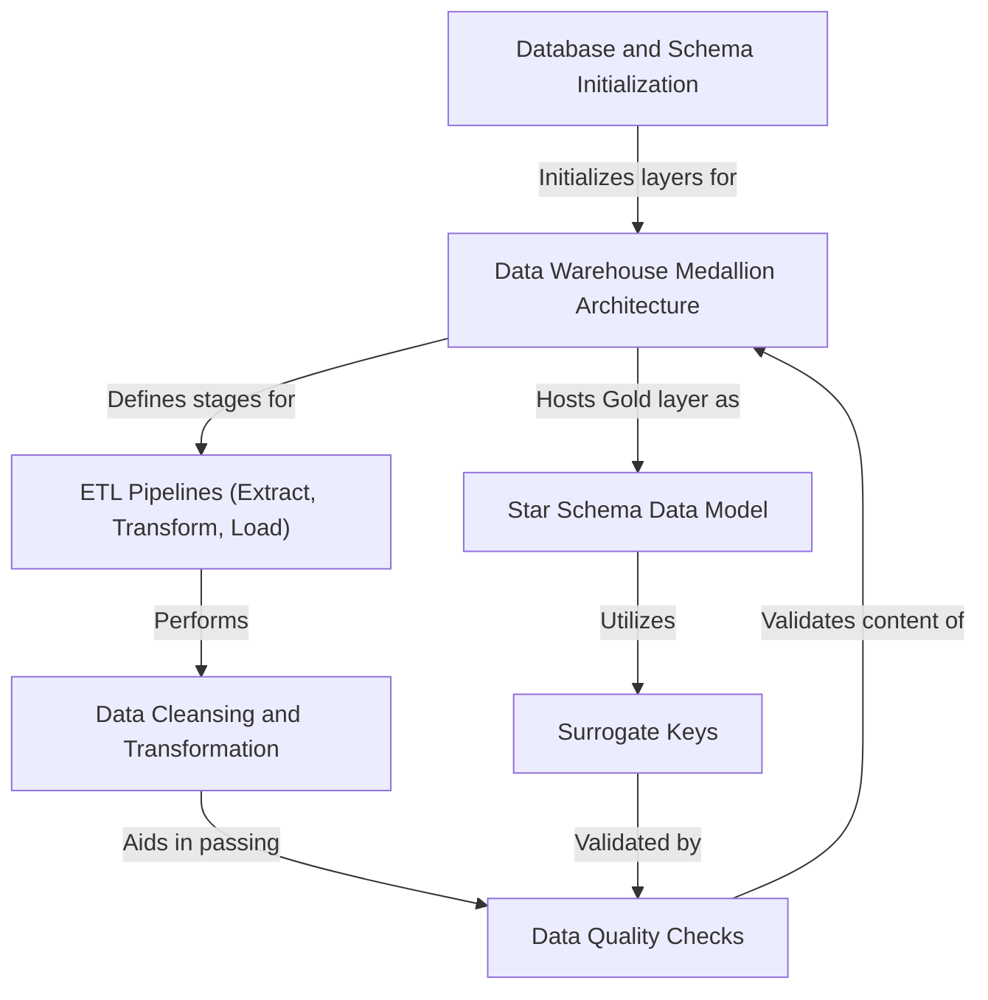

# Tutorial: SQL_Data_Warehouse_Project

This project builds a **modern data warehouse** following a *Medallion Architecture* (Bronze, Silver, Gold layers) to consolidate sales data. It utilizes **ETL pipelines** to extract raw data, perform *cleansing and transformations*, and then load it into a structured **Star Schema** for easy reporting and *business intelligence*. The ultimate goal is to provide reliable data for *actionable insights* into customer behavior, product performance, and sales trends.

## Visual Overview

## Chapters

1. [Data Warehouse Medallion Architecture
](01_data_warehouse_medallion_architecture_.md)
2. [Database and Schema Initialization
](02_database_and_schema_initialization_.md)
3. [ETL Pipelines (Extract, Transform, Load)
](03_etl_pipelines__extract__transform__load__.md)
4. [Data Cleansing and Transformation
](04_data_cleansing_and_transformation_.md)
5. [Star Schema Data Model
](05_star_schema_data_model_.md)
6. [Surrogate Keys
](06_surrogate_keys_.md)
7. [Data Quality Checks
](07_data_quality_checks_.md)

---

Generated by [AI Codebase Knowledge Builder](https://github.com/The-Pocket/Tutorial-Codebase-Knowledge).
